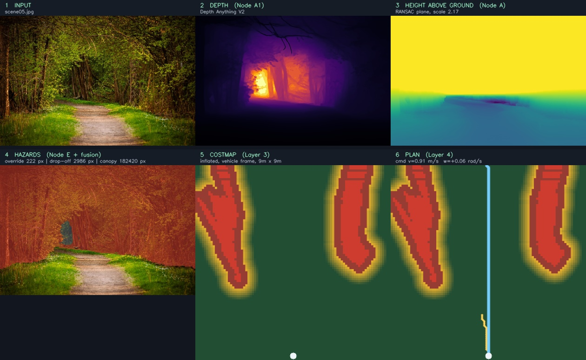
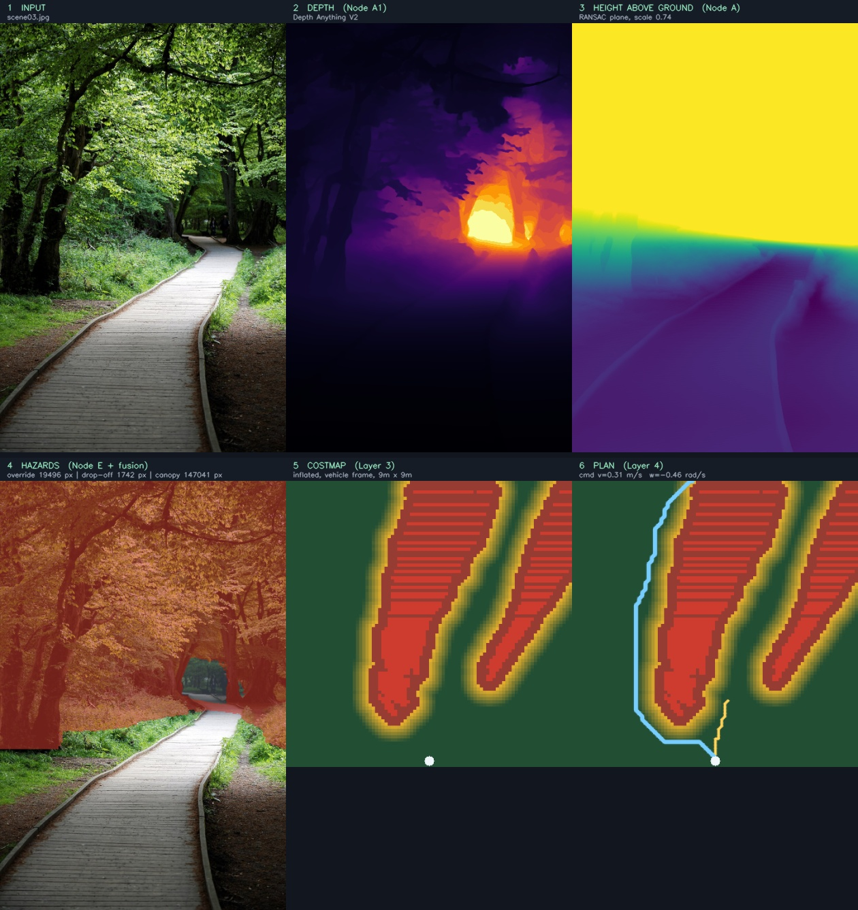
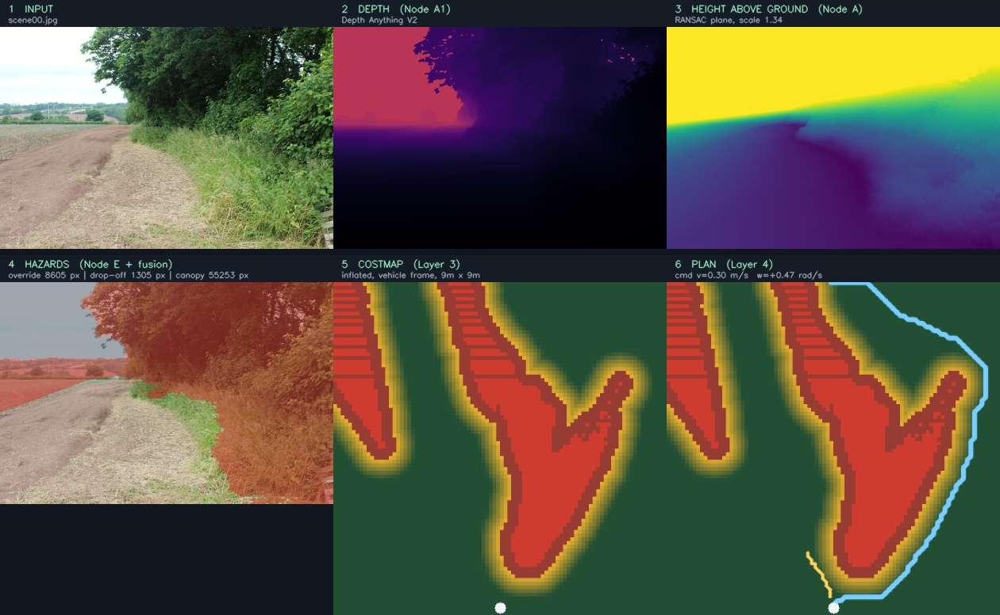
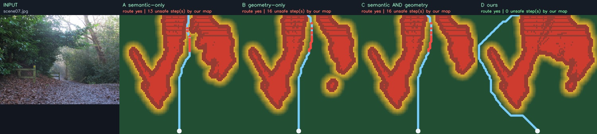

# ugvnav — vision-based autonomous navigation for UGVs

**One photograph in. One steering command out.**

Monocular perception, hazard resolution, costmap fusion and planning for an
unmanned ground vehicle driving in unstructured outdoor terrain — **without GPS
and without LiDAR**.

Reference implementation for **SIH26126** — *Vision Based Autonomous Navigation
for Unmanned Ground Vehicle for Outdoor Environment* (Bharat Electronics
Limited · theme *Smart Automation* · category *Software*).

```
all four layers · 95 tests · pure NumPy/OpenCV core · CPU only · no ROS needed
```

---

## What the vehicle actually sees

Every image below is a real run of `scripts/run_pipeline.py` on a real
photograph. Nothing is drawn by hand, nothing is simulated.

### A forest corridor



Read it left to right, top to bottom:

1. **INPUT** — an ordinary photograph. This is the vehicle's only sensor.
2. **DEPTH** — Depth Anything V2 recovers the tunnel of trees and the bright
   opening beyond.
3. **HEIGHT ABOVE GROUND** — a RANSAC plane is fitted to the drivable surface
   and every pixel is measured against it. The trail goes dark: it *is* the
   ground. The canopy goes bright: it is 4 m above us.
4. **HAZARDS** — forest marked lethal, **the trail and its grass verge left
   untouched**. The vehicle can see where it is allowed to drive.
5. **COSTMAP** — the same conclusion, top-down and metric, with obstacles
   inflated by the vehicle radius. Two tree masses, one gap.
6. **PLAN** — A\* threads the gap (blue), MPPI evaluates 500 rollouts and picks
   a trajectory (amber), and the controller emits `v = 0.91 m/s, ω = +0.06 rad/s`.
   Nearly straight, because the corridor is nearly straight.

### A curving boardwalk



The same pipeline on a path that bends right. The free corridor in the costmap
bends right with it, and the command becomes `v = 0.31 m/s, ω = −0.46 rad/s` —
slower and turning, because that is what the terrain demands.

This scene also produced **19 496 pixels of geometry override**: ground that
segmentation called drivable while the height field disagreed.

### An open track



Wider terrain, 81 pixels flagged as negative obstacles along the rut edges.

---

## Why this exists

A camera returns colour. It does not return danger. Five situations defeat
appearance-based perception outdoors, and each one can destroy a vehicle:

| # | Situation | Why appearance fails |
|---|-----------|----------------------|
| 1 | Ditches and drop-offs | In a photograph a hole and a shadow look identical |
| 2 | Moving hazards | One frame cannot say where a rolling rock will be in two seconds |
| 3 | Rocks buried in dirt | The obstacle wears the terrain, so segmentation says "soil" |
| 4 | Low branches | The ground is clear; the cargo deck is not |
| 5 | Glare and deep shadow | Networks do not go quiet when confused — they stay confident |

`ugvnav` answers all five with **geometry**, and fuses the answers into a single
costmap the planner consumes.

---

## The central idea: geometry outranks appearance

```python
from ugvnav import fuse

labels = np.full((20, 20), 2, np.uint8)     # semantics: confident this is grass
height = np.zeros((20, 20), np.float32)
height[5:10, 5:10] = 0.4                    # geometry: 40 cm is sticking out of it

result = fuse(labels, height)
result.grid[7, 7]        # LETHAL — the rock was caught
result.reasons           # {'geometry_override': 25, ...}
result.costmap[7, 7]     # 254, the Nav2 lethal value
```

A half-buried boulder is labelled *grass* because that is what its surface looks
like. Its **shape** gives it away. Where appearance and height disagree, height
wins. This is the `geometry_override`, and it is the core contribution.

---

## Architecture

Information flows one way. Each layer consumes only the layer above it, so any
component can be disabled and its contribution measured in isolation.

```
INPUT      camera · IMU · wheel odometry          (simulated or real ROS topics)
                          ↓
LAYER 1    A Elevation      B Semantics           perception
           C Uncertainty    D Visual odometry
                          ↓
LAYER 2    E Negative obstacles                   hazard resolution
           F Dynamic obstacles
           G Voxel / overhead clearance
                          ↓
LAYER 3    multi-layer costmap fusion             ← the contribution
           FREE 0 · CAUTION 128 · INSCRIBED 253 · LETHAL 254
                          ↓
LAYER 4    A* global · MPPI local · pure pursuit  → v, ω
```

### Layer 1 — perception

| Node | Module | Responsibility |
|------|--------|----------------|
| **A** | `layer1.elevation` | RANSAC ground-plane fit → signed height field, rescaled to the known camera mounting height to resolve monocular scale |
| **B** | `layer1.semantics` | SegFormer classes reduced to a 7-word traversability vocabulary |
| **C** | `layer1.uncertainty` | Augmentation consistency: run the depth net under perturbations, measure disagreement |
| **D** | `layer1.odometry` | ORB + essential matrix visual odometry — **pose without GPS** |
| — | `layer1.depth` | Monocular depth behind an interface (Depth Anything V2) |

### Layer 2 — hazard resolution

| Node | Module | Responsibility |
|------|--------|----------------|
| **E** | `layer2.negative_obstacle` | Vertical depth derivative + below-plane deviation → drop-offs, emitted as a per-column **virtual laser scan** |
| **F** | `layer2.dynamic` | Predicts the flow the vehicle's own motion causes and subtracts it; what still moves is genuinely moving, and gets a velocity vector |
| **G** | `layer2.voxel` | Sparse 3D occupancy → *"is anything solid between the wheels and the roof?"* |

### Layer 3 — costmap fusion

`layer3.costmap.Costmap` is a metric, vehicle-frame grid with Nav2's exact cost
values. Hazards are written in as layers, then inflated by the robot radius so
the planner may treat the vehicle as a point.

**The most pessimistic claim wins.** A cell is FREE only when nothing objected.
Uncertainty can downgrade FREE to CAUTION but can never erase a LETHAL — there
is a regression test for precisely that.

`add_dynamic()` sweeps a tracked obstacle forward along its velocity vector and
blocks **where it will be**, not where it was. That is the entire point of
tracking velocity.

### Layer 4 — planning and control

| Stage | Class | Behaviour |
|-------|-------|-----------|
| Global | `AStarPlanner` | Grid A\* that reads *cost*, not occupancy — a CAUTION corridor stays passable but expensive |
| Local | `MPPIPlanner` | Samples hundreds of control sequences through a unicycle model, scores them against the costmap, returns the cost-weighted average |
| Control | `PurePursuit` | Regulated pure pursuit, slowing for curvature **and for cost** — which is how the uncertainty layer changes behaviour rather than just colouring a map |

---

## Quick start

```bash
pip install -r requirements.txt
pytest -q                     # 95 tests, ~2 s, no model download required
```

The geometric core has no ML dependency at all. Model-backed nodes sit behind
interfaces (`StubDepth`, `StubSegmenter`), which is why the whole suite runs in
about two seconds on CPU.

Run the full pipeline on any photograph:

```bash
pip install torch transformers pillow          # first run downloads ~130 MB
python scripts/run_pipeline.py data/offroad/scene05.jpg assets/out.jpg
```

```
scene05.jpg  ->  assets/out.jpg
  reasons={'semantic_obstacle': 245447, 'geometry_override': 222,
           'negative_obstacle': 1398}   route=yes   cmd=v=0.91 w=+0.06
```

Use the library directly:

```python
from ugvnav import Camera, fuse
from ugvnav.layer1 import ElevationNetwork, MonocularDepth, to_metric
from ugvnav.layer2 import NegativeObstacleDetector
from ugvnav.layer3 import Costmap, GridSpec
from ugvnav.layer4 import AStarPlanner, PurePursuit

cam   = Camera.from_fov(640, 480, hfov_deg=70, height_m=0.8)
depth = to_metric(MonocularDepth().infer(rgb))
elev  = ElevationNetwork(cam).process(depth)
holes = NegativeObstacleDetector().process(depth, height=elev.height)

cm = Costmap(GridSpec(90, 90, 0.1, -4.5, 0.0))
cm.add_virtual_scan(holes.ranges, angles)
cm.inflate()

path = AStarPlanner(cm).plan((0.0, 0.3), (0.0, 6.0))
cmd  = PurePursuit().step((0.0, 0.3, 0.0), path, costmap=cm)
cmd.linear, cmd.angular       # metres/second, radians/second
```

---

## Dataset

`data/offroad/` holds 14 outdoor scenes — dirt tracks, forest trails, unpaved
roads and rutted farm tracks — collected from Wikimedia Commons under CC0,
CC BY and CC BY-SA licences. Per-file titles, licences and source URLs are
recorded in [`data/offroad/SOURCES.json`](data/offroad/SOURCES.json).

They are deliberately *not* robotics-dataset frames: if the stack only works on
the images it was tuned against, it does not work.

---

## Comparison against alternative methods

`scripts/benchmark.py` runs four traversability policies on **identical input**.
Depth, segmentation and the ground-plane fit are computed **once and shared**, so
every difference in the result is attributable to the fusion policy alone — not
to a different network or a different image.

| | Method | What it represents |
|---|--------|--------------------|
| **A** | semantic-only | what most appearance-based off-road stacks do |
| **B** | geometry-only | height threshold above the fitted ground plane |
| **C** | semantic **AND** geometry | the permissive intersection — block only when both agree |
| **D** | **ours** | semantics + geometry override + drop-offs + uncertainty |

Each method plans its own route; then **every route is scored against every
method's hazard map**. A path that A calls safe but D calls lethal is a
concrete, countable failure of A.

### Where they disagree



A, B and C all drive straight up the middle and clip the obstacle — the red dots
are steps our hazard map considers lethal. **D routes left around it entirely**,
and pays for that with a longer path.

On easy scenes with a clear corridor all four agree exactly; the difference only
appears where the terrain is ambiguous, which is the whole point.

### Results over 14 scenes

```
method                      routes  mean path m  unsafe steps  mean lethal %
----------------------------------------------------------------------------
A semantic-only             13/14          9.63            82          14.8%
B geometry-only             13/14          9.66           119          13.4%
C semantic AND geometry     13/14          9.42           177          10.4%
D ours                      13/14         10.36             0          18.2%
```

Cross-judgement — rows are whose path, columns are whose hazard map judged it:

|  | A | B | C | **D** |
|---|---|---|---|---|
| A semantic-only | 0 | 58 | 0 | **82** |
| B geometry-only | 102 | 0 | 0 | **119** |
| C semantic AND geometry | 102 | 58 | 0 | **177** |
| **D ours** | **0** | **0** | **0** | 0 |

**The bottom row is the result.** Ours is the only policy whose route *no other
method objects to*. Every other policy plans a path that some other method
considers lethal — C worst of all, because requiring both cues to agree before
blocking is exactly how a dirt-covered rock gets driven over.

It costs about **8 % extra path length** (10.36 m vs 9.42 m) and marks more of
the world lethal (18.2 % vs 10.4 %), while still finding a route on the same
13 of 14 scenes. That is the trade we want: slightly longer, materially safer,
no loss of capability.

### Honest caveats

- **These photographs have no pixel-wise ground truth.** This is not an accuracy
  benchmark against published numbers — it measures agreement and route safety,
  not correctness.
- **The diagonal of the matrix is zero by construction.** A method never judges
  its own path unsafe. Only the off-diagonal entries carry information, which is
  why the claim rests on D's *row* (0, 0, 0) and not on its diagonal cell.
- **D is the most conservative policy**, so it is naturally less likely to be
  flagged. The meaningful counterweight is that it still routes on 13/14 scenes
  and adds only 8 % path length — conservatism that cost capability would show
  up as failed routes, and it does not.
- **Scene 10 fails for all four methods.** Consistent across policies, so it is
  an input or perception limitation rather than a fusion one; not yet diagnosed.

Reproduce:

```bash
python scripts/benchmark.py                                    # table + CSV + JSON
python scripts/benchmark.py --figure scene07.jpg out.jpg       # side-by-side
```

Raw per-scene numbers: [`assets/benchmark.csv`](assets/benchmark.csv) ·
[`assets/benchmark.json`](assets/benchmark.json)

---

## Benchmark against RELLIS-3D ground truth

The comparison above can only measure methods against *each other*. This one
scores them against **human pixel labels** from RELLIS-3D, an off-road robotics
dataset collected on unpaved trails at Texas A&M. No method judges its own
output, so nothing here is circular.

```bash
python scripts/fetch_rellis.py --n 120     # pulls only the test frames it needs
python scripts/benchmark_gt.py
```

`fetch_rellis.py` reads the 5.2 GB archive's ZIP index over HTTP range requests
and extracts only the frames required, rather than downloading all of it.

### Results — 52 RELLIS-3D test frames, void/sky excluded

```
method                      IoU trav  IoU block    mIoU  FALSE-SAFE  FALSE-BLOCK
--------------------------------------------------------------------------------
A semantic-only                0.705      0.512   0.609       48.2%        0.9%
B geometry-only                0.713      0.525   0.619       47.4%        0.3%
C semantic AND geometry        0.669      0.415   0.542       58.5%        0.1%
D ours                         0.754      0.627   0.691       36.1%        1.6%
```

**FALSE-SAFE** — ground-truth obstacle the method would have driven into.
**FALSE-BLOCK** — ground-truth drivable ground the method refused.

Ours wins on every metric: best mIoU (**0.691** vs 0.609 / 0.619 / 0.542) and
**11.3 points less false-safe** than the strongest baseline. It refuses slightly
more real ground in exchange (1.6 % vs 0.3 %) — the right direction for a
vehicle, since a missed obstacle is a collision and an over-blocked patch of
grass is a detour.

C — block only when both cues agree — is the **worst** method by a wide margin.
That is the empirical case against permissive fusion, and the reason the
geometry override is an *override* rather than an intersection.

The ranking is stable: on a 26-frame subset the same ordering held
(D 0.654 mIoU / 44.5 % false-safe), so this is not an artefact of sample choice.

### But 36 % false-safe is not a good number

Ours is the best of four and still misses about a third of all labelled
obstacles. That is not a result to present as a success, so here is the
diagnosis over the same 52 frames:

```
FALSE-SAFE by ground-truth class
  obstacle     31.8%   of 3 730 812 px
  water        82.3%   of   344 864 px

What our segmenter calls each RELLIS class (row-normalised)
GT                        trail      grass   vegetation   obstacle     water
obstacle                  35.3%       9.7%        42.1%       1.7%      3.0%
water                     46.5%      36.3%         0.5%       1.4%     15.3%
unstable (grass/dirt)     14.8%      84.6%         0.2%       0.1%      0.3%
```

**The dominant error is a semantic domain gap, not the fusion policy.**
SegFormer is trained on ADE20k — indoor and urban scenes. It labels **35 % of
RELLIS obstacle pixels as "trail"**, because dense off-road bush and scrub match
ADE20k's *earth* / *field* / *land* classes. Only 1.7 % of true obstacle pixels
get the obstacle label at all. Geometry rescues a large share of that — D cuts
false-safe from 48.2 % to 36.1 % — but it cannot rescue a low bush that is both
mislabelled *and* barely raised above the ground plane.

Where the labels *are* right, the stack is strong: grass and dirt are recognised
**84.6 %** of the time, which is why IoU on traversable ground reaches 0.754.

**Water remains largely undetected — 82.3 % false-safe.** Mud and puddles are
read as trail (46.5 %) or grass (36.3 %); only 15.3 % are called water. That is
a genuine capability gap, not a tuning problem, and a real hazard: RELLIS
labels water as non-traversable for good reason.

### What this means

- The **relative** ranking is trustworthy and reproducible: the geometry
  override measurably improves safety over every baseline tested.
- The **absolute** numbers are not deployment-ready, and the reason is now
  quantified rather than guessed: fine-tuning segmentation on off-road classes
  is the single highest-value next step, worth far more than any further tuning
  of the fusion rules.
- These are **zero-shot** numbers. Nothing in this repository was trained on
  RELLIS-3D. Published RELLIS benchmarks use models trained on its train split,
  so this is not directly comparable to them.

Raw per-frame numbers: [`assets/benchmark_gt.csv`](assets/benchmark_gt.csv) ·
[`assets/benchmark_gt.json`](assets/benchmark_gt.json)

### Dataset licence

RELLIS-3D is **CC BY-NC-SA 3.0** — non-commercial, attribution, share-alike.
The frames are therefore **not committed to this repository**; `fetch_rellis.py`
downloads them locally and `data/rellis3d/` is gitignored, so this Apache-2.0
repo stays free of share-alike content.

> Jiang et al., *RELLIS-3D Dataset: Data, Benchmarks and Analysis*, 2020.
> https://github.com/unmannedlab/RELLIS-3D

---

## How this compares to existing projects

A full survey is in [`docs/RELATED_WORK.md`](docs/RELATED_WORK.md). The short
version: **no open-source project covers all of it.**

| | ugvnav | [Offroad-Nav](https://github.com/LARIAD/Offroad-Nav) | [Autoware](https://github.com/autowarefoundation/autoware) | [WVN](https://github.com/leggedrobotics/wild_visual_navigation) | [elev_mapping_cupy](https://github.com/leggedrobotics/elevation_mapping_cupy) |
|---|---|---|---|---|---|
| Monocular-only | ● | ● | ○ | ● | ◐ |
| Semantics | ● | ○ | ● | ◐ | ○ |
| **Localization / SLAM** | **◐ VO only** | **● VINS-Mono** | ● | ○ | ○ |
| Negative obstacles | ● | ○ | ◐ | ○ | ◐ |
| Dynamic obstacles | ● | ○ | ● | ○ | ○ |
| Overhead clearance | ● | ○ | ◐ | ○ | ○ |
| **Geometry override** | **●** | ○ | ○ | ○ | ○ |
| Multi-layer costmap | ● | ◐ binary | ● | ○ | ◐ |
| Planning | ● A\*/MPPI | ● A\*/TEB | ● | ○ | ○ |
| ROS 2 | ○ | ○ ROS 1 | ● | ○ | ● |
| **Field-tested on a vehicle** | **○** | **●** | ● | ● | ● |

`LARIAD/Offroad-Nav` is the closest comparable work, and it independently chose
**the same depth backbone we did** (Depth Anything V2). Its costmap is a single
binary height threshold at 30 cm — which cannot separate a rock from tall grass,
and cannot see a ditch at all, because a hole is *below* the plane and a height
threshold never fires on it.

**Where we are behind, and it matters:** they have real metric localization
(VINS-Mono + EKF over GNSS/IMU) and published closed-loop results on an actual
vehicle — 100 % success rate, 59 % SPL monocular. We have visual odometry with
no loop closure and no filter, segmentation IoU on 52 still frames, and no
closed-loop result of any kind. For a problem statement that explicitly requires
position and orientation without GPS, localization is our weakest area.

Also worth noting: WVN's **self-supervised** traversability — learn from what the
robot successfully drove over — is probably a better answer to the 35 %
obstacle-mislabel rate our benchmark measured than supervised fine-tuning would
be, because it needs no off-road annotations at all.

---

## Capabilities

✅ **Implemented and tested**

- Pinhole camera model, depth back-projection, RANSAC ground-plane fitting
- Metric scale recovery from known camera mounting height
- Height-above-ground field and top-down elevation rasterisation
- Semantic segmentation mapped to a traversability vocabulary
- Negative obstacle detection (two independent cues) + virtual scan output
- Ego-motion compensated dynamic detection with velocity tracks
- Sparse voxel mapping and overhead clearance queries
- Augmentation-consistency uncertainty estimation
- Monocular visual odometry with scale injection
- Multi-layer costmap with Nav2 cost values, inflation, forward sweeping of
  dynamic obstacles
- A\* global planning, MPPI local planning, regulated pure pursuit
- End-to-end pipeline: photograph → `v, ω`

⚠️ **Runs, not yet tuned on field data** — quantified below: 36 % of
RELLIS-3D obstacles are missed, driven by the ADE20k domain gap

- Segmentation uses ADE20k classes; RUGD or RELLIS-3D fine-tuning is the next
  step for genuine off-road vocabulary
- Depth scale is plausible rather than surveyed
- Nodes F and G are exercised by tests, not yet wired into the single-image
  pipeline — both need an image *sequence*

❌ **Not implemented**

- ROS 2 node wrappers and `costmap_2d` plugin builds
- Loop closure / full SLAM back-end (Node D is odometry, not SLAM)
- Simulator integration and closed-loop navigation runs
- IMU and wheel-odometry fusion (interfaces exist, filter does not)

**Nothing here has driven a vehicle, simulated or real.** It is a perception,
fusion and planning library with a verified core and a working single-frame
pipeline.

---

## Testing philosophy

Every geometric component is checked against **exactly-known ground truth**,
never against its own previous output:

- Back-projection then projection must be the identity, to 1e-6
- A synthetic plane at `y = 1.5` must be recovered exactly, and still recovered
  with 20 % outliers present
- Visual odometry must recover a **known** 5° rotation and a known translation
  direction from synthetically projected 3D points
- Ego-motion compensation must report **zero** moving objects when the entire
  scene translates, and must find the object when one patch moves further than
  the background
- A branch at 1.2 m must block a 1.5 m vehicle and clear a 1.0 m one
- A\* must thread a gap in a wall, and return empty when the wall is solid

### Bugs these tests caught

The suite earned its keep immediately — six real defects, all found by tests or
by running on real photographs rather than by inspection:

1. **Voxel quantisation.** `1.2 / 0.2` evaluates to `5.999…` in binary floating
   point, so a branch at exactly 1.2 m was filed one voxel too low and a 1.0 m
   vehicle was wrongly reported as blocked.
2. **Zero-gradient threshold collapse.** On perfectly flat depth the percentile
   threshold became `0`, and `magnitude >= 0` flagged *every pixel in the image*
   as a drop-off edge.
3. The same collapse defeated the small-blob filter.
4. **`clearance_map` point sampling.** It probed one point per cell, so an
   occupied voxel between sample points was silently missed. It now tests every
   voxel column overlapping each cell.
5. **Canopy projected onto the path.** Found on scene03: every lethal pixel was
   being projected straight down into the ground costmap, so a tree canopy 4 m
   above the trail walled off the corridor underneath it and no route existed.
   Only obstruction *within the vehicle's height band* blocks the ground —
   anything higher is Node G's problem.
6. **Horizon firing.** A naive depth gradient fires hardest on the sky/ground
   boundary, because that is the strongest depth discontinuity in any outdoor
   frame. Hence the `valid` mask parameter.

---

## Roadmap

| Stage | Work | Status |
|-------|------|--------|
| 1 | Layer 1 + Layer 2 core, fully tested | **done** |
| 2 | Layer 3 costmap + Layer 4 planning and control | **done** |
| 3 | End-to-end single-frame pipeline on real imagery | **done** |
| 4 | Sequence pipeline — wire in Nodes F and G, fuse IMU/odometry | next |
| 5 | Fine-tune segmentation on RUGD / RELLIS-3D off-road classes | **next — benchmark shows this is the dominant error source** |
| 6 | ROS 2 Humble node wrappers, real topic I/O | planned |
| 7 | Nav2 `costmap_2d` plugins replacing the NumPy fusion | planned |
| 8 | Gazebo worlds with authored ditches, overhangs, moving hazards | planned |
| 9 | Ablation study — disable one layer, measure collision rate | **done** (`scripts/benchmark.py`) |

---

## Licensing

This project is **Apache-2.0**. Dependencies were chosen so the result stays
permissively licensed and can be handed over without copyleft obligations —
which matters for a defence-sector recipient.

| Component | Licence | Note |
|-----------|---------|------|
| Depth Anything V2 | Apache-2.0 | chosen over monodepth2, which is research-only |
| SegFormer | Apache-2.0 | chosen over YOLOv8, which is AGPL-3.0 |
| OpenCV, NumPy | BSD / Apache | |
| *Planned:* RTAB-Map | BSD-3 | chosen over ORB-SLAM3, which is **GPL-3.0** |
| *Planned:* Nav2 | Apache-2.0 | |

No GPL or AGPL component is used anywhere in this stack.

---

## Repository layout

```
ugvnav/
  camera.py              pinhole model, back-projection, RANSAC plane fitting
  fusion.py              image-space fusion + the geometry override
  layer1/
    depth.py             monocular depth interface + Depth Anything V2
    elevation.py         Node A — ground plane and height field
    semantics.py         Node B — traversability vocabulary
    uncertainty.py       Node C — augmentation-consistency uncertainty
    odometry.py          Node D — visual odometry, pose without GPS
  layer2/
    negative_obstacle.py Node E — ditches and drop-offs
    dynamic.py           Node F — ego-motion compensated tracking
    voxel.py             Node G — 3D occupancy and overhead clearance
  layer3/
    costmap.py           metric costmap, inflation, dynamic sweeping
  layer4/
    planner.py           A*, MPPI, regulated pure pursuit
docs/
  RELATED_WORK.md        capability survey of comparable open-source projects
scripts/
  run_pipeline.py        photograph -> six-panel figure -> v, omega
  benchmark.py           four fusion policies on identical input
  benchmark_gt.py        scored against RELLIS-3D human labels
  fetch_rellis.py        pulls RELLIS test frames from a remote zip
data/offroad/            14 CC-licensed outdoor scenes + SOURCES.json
tests/                   95 tests against synthetic ground truth
```
