# Research map — what exists, and what we take from it

Landscape for the three gaps our RELLIS-3D benchmark exposed: water detection
(82.3 % missed), the semantic domain gap (35 % of obstacles labelled "trail"),
and hard-terrain closed-loop failure (4 % success rate).

Repository facts verified via the GitHub API, September 2026.

---

## The landscape

```mermaid
graph TD
    subgraph GAP1["GAP 1 · domain gap — 35% of obstacles mislabelled"]
        WVN["<b>Wild Visual Navigation</b><br/>leggedrobotics · MIT · 316★<br/>RSS 2023 + AuRo 2025"]
        SALON["SALON<br/>ICRA 2025 · castacks<br/>no licence, 0★"]
        PROTO["Online Prototype Adaptation<br/>arXiv 2504.12109"]
        ROAM["Robot-Agnostic Traversability<br/>arXiv 2605.28442"]
    end

    subgraph GAP2["GAP 2 · water — 82% missed"]
        RAU["<b>FCN + Reflection Attention</b><br/>Han et al. ECCV 2018<br/>no public code"]
        POL["Polarised stereo water tracking<br/>arXiv 1701.04175"]
        FRED["FRED flooded-road dataset<br/>arXiv 2605.22018"]
    end

    subgraph GAP3["GAP 3 · closed-loop failure on hard terrain"]
        ONAV["<b>Offroad-Nav</b><br/>LARIAD · MIT · 68★<br/>100% SR, 59% SPL"]
        NAV2["Nav2<br/>Apache-2.0 · 4.7k★"]
        VERTI["VertiCoder<br/>arXiv 2409.11570"]
    end

    OURS["<b>ugvnav</b><br/>this project"]

    WVN -->|"proprioceptive positives:<br/>terrain we drove on IS traversable"| OURS
    PROTO -->|"online prototypes,<br/>no gradient training"| OURS
    RAU -->|"reflection cue:<br/>water mirrors the scene above it"| OURS
    POL -.->|"polarisation — needs a<br/>filter we do not have"| X1["not adopted"]
    ONAV -->|"recovery behaviour,<br/>speed scaling"| OURS
    NAV2 -->|"cost values, inflation<br/>(already mirrored)"| OURS
    FRED -.->|"evaluation data,<br/>not a method"| X2["future eval"]

    style OURS fill:#2c5f2d,color:#fff
    style WVN fill:#1f3864,color:#fff
    style RAU fill:#1f3864,color:#fff
    style ONAV fill:#1f3864,color:#fff
    style X1 fill:#6b6b6b,color:#fff
    style X2 fill:#6b6b6b,color:#fff
```

---

## Papers

| Paper | Venue | What we take |
|---|---|---|
| Frey, Mattamala et al., *Wild Visual Navigation: fast traversability learning via pre-trained models and online self-supervision* | RSS 2023 · Auton. Robots 2025 | **The core idea: the terrain the robot just drove over is, by definition, traversable.** Project the footprint back into past frames and harvest free positive labels. No annotation needed. |
| *Self-Supervised Traversability Learning with Online Prototype Adaptation* | arXiv 2504.12109 | Maintain class **prototypes** in feature space and match by distance, instead of back-propagating online. Cheap, stable, and CPU-friendly — which matters here. |
| Han et al., *Single Image Water Hazard Detection Using FCN with Reflection Attention Units* | ECCV 2018 | **The reflection cue**: a water pixel's appearance correlates with the scene *vertically above* it, because it is a mirror. We implement the physics directly instead of learning it. |
| Rankin & Matthies, *Passive sensor evaluation for UGV mud detection* | — | Water and mud are **smoother** than surrounding terrain and shift toward sky colour. Texture variance plus chroma are usable monocular cues. |
| Nguyen et al., *3D tracking of water hazards with polarised stereo cameras* | arXiv 1701.04175 | Confirms polarisation is the strongest cue — and that we cannot use it with one ordinary camera. Recorded as a known ceiling. |
| Sivaprakasam et al., *SALON: Self-supervised Adaptive Learning for Off-road Navigation* | ICRA 2025 | Adaptation in minutes, not hours. Validates online adaptation over offline fine-tuning for our 6-day constraint. |
| *An Open-Source LiDAR and Monocular Off-Road Navigation Stack* | arXiv 2604.03096 | Recovery behaviour and conservative speed on clutter — the two things our hard-terrain runs lack. |

---

## What we adopt, and why

### 1. Self-supervised adaptation — from WVN + prototype adaptation

**The insight that makes it free:** if the vehicle drove over a patch and did not
collide or bog down, that patch *was* traversable. No human labels the image;
the robot's own experience does.

We take the prototype variant rather than WVN's online gradient training,
because prototypes need no backward pass and run on CPU:

- maintain a running **traversable prototype** and **obstacle prototype** in a
  small per-patch feature space (colour statistics, texture energy, height);
- label the swept footprint behind the vehicle as traversable;
- label anything that triggered a collision or a lethal costmap cell as obstacle;
- classify new patches by prototype distance, and blend that with the
  pre-trained semantic prediction weighted by confidence.

This attacks the measured 35 % mislabel rate at its root: it does not need
SegFormer to know what an off-road bush is, only that *this* terrain, *here*,
was driven.

**Not adopted:** WVN's DINO ViT features. Excellent, but a ViT forward pass per
frame defeats the CPU-only constraint.

### 2. Water detection — from the ECCV reflection cue, implemented as physics

No public implementation of the ECCV model exists, and polarisation needs
hardware we do not have. Three monocular cues remain, and all three are cheap:

| Cue | Physics | Signal |
|---|---|---|
| **Reflection** | Water mirrors the scene above it | Correlation between a patch and the vertically-mirrored patch above the shoreline |
| **Smoothness** | Still water has no texture | Local intensity variance far below surrounding terrain |
| **Sky chroma** | A puddle reflects the sky | Blue shift and desaturation relative to nearby ground |

Any one is weak; combined they are usable. This is a *physics-motivated
detector*, not a learned one, so it needs no training data — which is exactly
what our situation calls for.

### 3. Hard terrain — from Offroad-Nav and Nav2

Our failures are collision-dominated, so the fixes are behavioural, not
perceptual:

- **speed scaled by clutter** — slow where the costmap is dense, as the
  regulated pure-pursuit design already allows but is not yet driven by;
- **recovery behaviour** — Nav2's pattern: when no plan exists, rotate to widen
  the field of view instead of reversing blindly;
- **more conservative inflation on clutter**, trading path length for margin.

---

## What we deliberately do not take

| | Why |
|---|---|
| Polarisation sensing | Needs a polarising filter; we have one ordinary camera |
| DINO / ViT features | Breaks the CPU-only, no-GPU constraint |
| `castacks/SALON` code | Published without a licence — legally unusable |
| LiDAR fusion | The entire point is that this works without it |
| FRED, RUGD as training data | Evaluation only; training on them would undercut the zero-shot claim |
